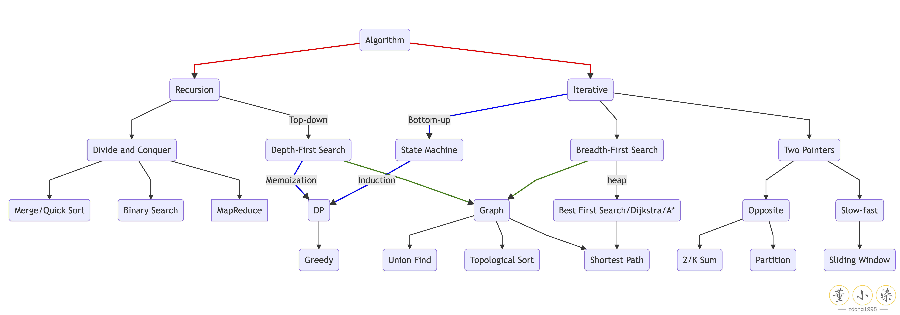
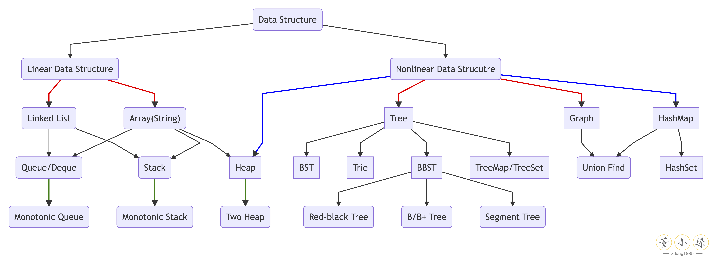

      

文章首发于公众号『[董小染](./docs/img/wechat.png)』，算法文章主页：[https://dongxiaoran.com/algo/](https://dongxiaoran.com/algo/)

---

PS: 本仓库含有按类别总结题目的源码，便于本地 debug 练习。对于没有收录的题目，欢迎点击上方 Badge 链接阅读我的 [LeetCode Solution Well Explained](https://github.com/zdong1995/LeetCode-Solution-Well-Explained) 代码。如果对你有帮助欢迎在 **Github 点个 Star**，给我继续更新的动力，谢谢！

在当前 LeetCode 千题时代下，刷完所有的题目是不现实的，因此更重要的是培养自己的**算法思维**和扎实**数据结构知识**，举一反三，深化思维。我们的目的不是完成题目，而是掌握思维过程和解决问题的能力，争取**做一题解决一类题目**，一通百通，高效快速准备算法面试。

本仓库归纳总结了 LeetCode 的同类型及相似思路的题目，按照从易到难的顺序，从线性到非线性数据结构的『**增删改查**』，从基础 Iterative 到深化 Recursion 思想，从 Intuitive 的算法到高阶的优化技巧，选取都是我认为比较经典或培养算法思维的题目，带你搭建起来自己的**思维框架**和**套路模板**。

- 第一部分：从基础数据结构入手，从**递归**思想的入门与深化，再到高频的**双指针**和排序算法。
- 第二部分：掌握搜索算法，宽度优先，深度优先，到**记忆化存储**，**剪枝**优化，入门**动态规划**。
- 第三部分：高频面试题目分析，复杂题目讲解，高级数据结构等。

在开始刷题学习前，花几分钟阅读一下我总结的算法学习方法论和我的刷题练习经验分享，帮助你建立一个更清晰的 big picture 和学习思路。

- [半年零基础到 LeetCode 300 题，我的算法学习方法论](https://dongxiaoran.com/algo/basic/intro/)
- [当我们谈论刷题时，到底在刷什么](https://dongxiaoran.com/algo/basic/how/)

### 目录

1. [基础数据结构与算法](https://github.com/zdong1995/Pattern-Summary-for-Algorithm-Problems#1-基础数据结构与算法)
2. [优雅重要的递归思维](https://github.com/zdong1995/Pattern-Summary-for-Algorithm-Problems#2-优雅重要的递归思维)
3. [巧妙高效的双指针](https://github.com/zdong1995/Pattern-Summary-for-Algorithm-Problems#3-巧妙高效的双指针)
4. [轻松手写排序算法](https://github.com/zdong1995/Pattern-Summary-for-Algorithm-Problems#4-轻松手写排序算法)
5. [宽度优先搜索 \(BFS\)](https://github.com/zdong1995/Pattern-Summary-for-Algorithm-Problems#5-宽度优先搜索)
6. [深度优先搜索 \(DFS\)](https://github.com/zdong1995/Pattern-Summary-for-Algorithm-Problems#6-深度优先搜索)
7. [数学归纳法与动态规划 \(DP\)](https://github.com/zdong1995/Pattern-Summary-for-Algorithm-Problems#7-从数学归纳法入门动态规划)
8. [高频题目类型讲解](https://github.com/zdong1995/Pattern-Summary-for-Algorithm-Problems#8-高频题目类型讲解)

### 1. 基础数据结构与算法 

#### 1.1 LinkedList 的 Iterative 操作
- **Article**: [一题顶四题，一道题掌握 LinkedList 的 Iterative](https://dongxiaoran.com/algo/basic/iterativelist/)
- **Algorithm Questions**:
    - LC143: Reorder List
    - LC876: Find the middle node of Linked List
    - LC206: Reverse Linked List
    - LC21: Merge Two Sorted Linked list 
- **Solution**: [My Java Code](src/main/java/algorithm/basic/iterative)
  
#### 1.2 Tree Iterative Traversal as Multi-level LinkedList

- **Article**: [Tree 还可以这样 O(1) 空间遍历？四题带你深入理解 LinkedList 与 Tree 的关系](https://dongxiaoran.com/algo/basic/treetolist/)
- **Algorithm Questions**:
    - LC114: Flatten Binary Tree to Linked List
    - LC430: Flatten a Multilevel Doubly Linked List
    - LC116: Populating Next Right Pointers in Each Node
    - LC117: Populating Next Right Pointers in Each Node II
- **Solution**: [My Java Code](src/main/java/algorithm/basic/iterativetree)

### 2. 优雅重要的递归思维

- [ ] Introduction to Recursion

- [ ] Recursion in LinkedList

- [ ] Recursion in Tree

- [ ] Recursion to Iterative

### 3. 巧妙高效的双指针

- [x] Two Sum Pattern: [Code](src/main/java/algorithm/pointers/twosum)
- [ ] Slow-Fast Pointers

- [ ] K-way Merge

- [ ] Deduplication

- [ ] Sliding Window

- [ ] Partition

### 4. 轻松手写排序算法

- [ ] Merge Sort

- [ ] Quick Sort

- [ ] Quick Selection

- [ ] Comparison-based Sort

## 5. 宽度优先搜索

- [ ] Level Order Traversal

- [ ] The Shortest Path

- [ ] Connected Component

- [ ] Topology Sorting

- [ ] Best First Search and Dijkstra

## 6. 深度优先搜索

- [ ] Subset

- [ ] Permutation

- [ ] Parentheses

- [ ] Memoization

- [ ] Graph Search

## 7. 从数学归纳法入门动态规划

- [ ] 1D DP

- [ ] 2D DP

- [ ] Greedy

## 8. 高频题目类型讲解

- [ ] Merge Intervals

- [ ] Two Heap Pattern

- [ ] Top-K Problem

- [ ] Union Find

- [ ] Data Structure Design

- [ ] Bit Operations

